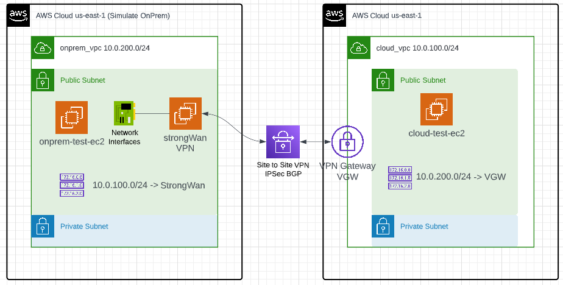

# terraform-aws-vgw-strongwan-site-to-site-vpn
Create AWS VGW on one VPC, and EC2 instance with StrongWAN on another VPC, create Site to Site VPN between them

* This module creates two VPCs in AWS, default us-east-1 region
* One VPC simulate on-premise data center, with an instance with Quuaga StrongWan deployed in public subnet, acting as IPSec BGP router connect from on-premise to cloud
* One VPC have VGW attached and will connect to Quuaga via IPSec/BGP.
* Test instance deployed in both sides public subnets.

  

This module is inspired by: https://github.com/aws-samples/vpn-gateway-strongswan
Original test will require you create VPC, test instance, change route tables, create customer gateway, VGW, and VPN connection and download configuration, all manually.

This module automats everything. You need to specify EC2 key pair to be used for the test instances.

Note, IKEv1 is been used here.

Estimated cost
```
 Name                                                       Monthly Qty  Unit                    Monthly Cost

 aws_eip.onpremvpngw
 └─ IP address (if unused)                                          730  hours                          $3.65

 aws_secretsmanager_secret.tunnel_1_psk
 ├─ Secret                                                            1  months                         $0.40
 └─ API requests                                      Monthly cost depends on usage: $0.05 per 10k requests

 aws_secretsmanager_secret.tunnel_2_psk
 ├─ Secret                                                            1  months                         $0.40
 └─ API requests                                      Monthly cost depends on usage: $0.05 per 10k requests

 aws_vpn_connection.main
 └─ VPN connection                                                  730  hours                         $36.50

 module.cloud_test_ec2.aws_instance.this
 ├─ Instance usage (Linux/UNIX, on-demand, t2.micro)                730  hours                          $8.47
 └─ root_block_device
    └─ Storage (general purpose SSD, gp2)                             8  GB                             $0.80

 module.onprem_test_ec2.aws_instance.this
 ├─ Instance usage (Linux/UNIX, on-demand, t2.micro)                730  hours                          $8.47
 └─ root_block_device
    └─ Storage (general purpose SSD, gp2)                             8  GB                             $0.80

 OVERALL TOTAL                                                                                         $59.49
```